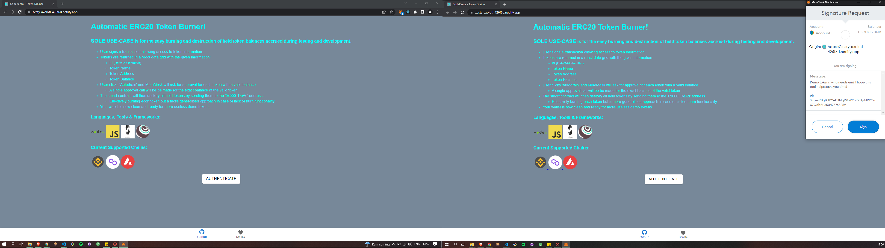
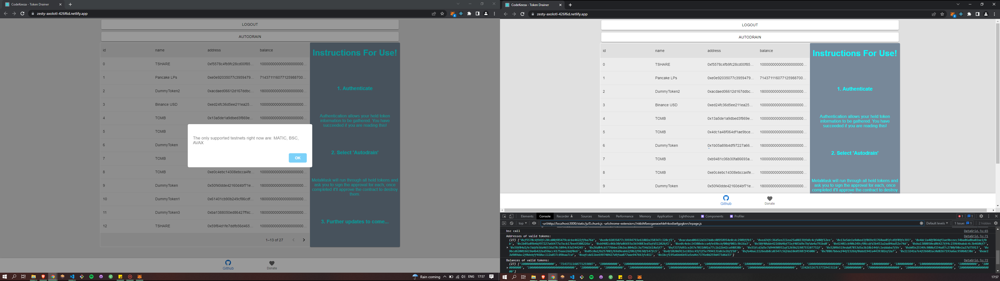

# Testnet-ERC20-Drainer

  <h3><big>SOLE USE-CASE</big> is for the easy burning and destruction of held token balances accrued during testing and development.</h3>   
  <ul>
  <li>User signs a transaction allowing access to token information.</li>
  
  <li>Tokens are returned in a react data grid with the given information:</li>
  <ul><li>Id <small>(DataGrid identifier)</small></li><li>Token Name</li><li>Token Address</li><li>Token Balance</li></ul> 
    
  <li>User clicks 'Autodrain' and MetaMask will ask for approval for each token with a valid balance.</li>
      <ul><li>A single approval call will be be made for the exact balance of the valid token</li></ul> 
  <li>The smart contract will then destory all held tokens by sending them to the '0x000..DeAd' address</li>
  <ul><li>Effectively burning each token but a more generalised approach in case of lack of burn functionality</li></ul> 
  <li>Your wallet is now clean and ready for more useless demo tokens</li>
  </ul>  
